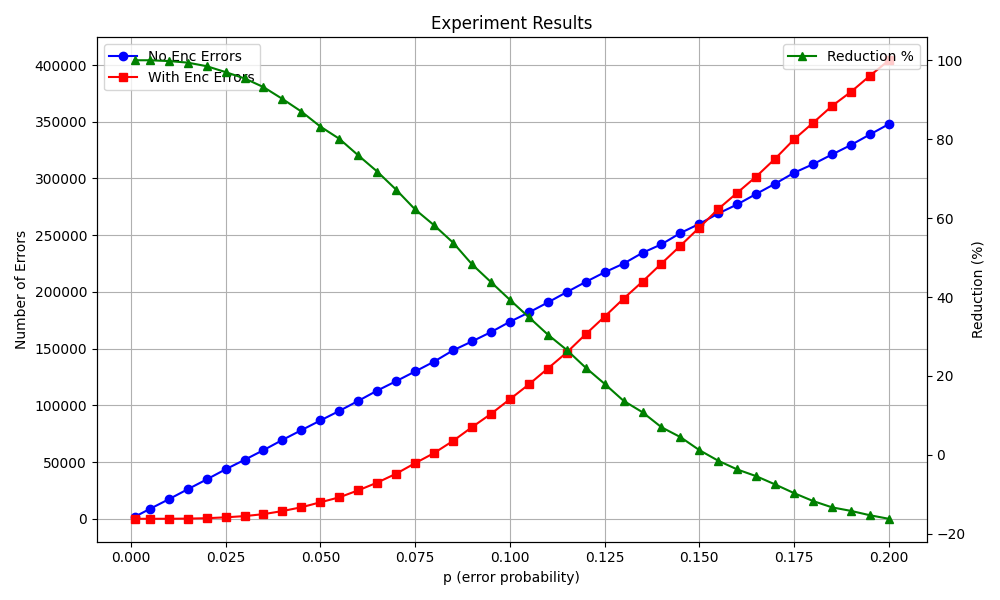

# Ataskaita

**Autorius:** Mindaugas Kalvinskas

## Golay Kodas (A13)

Realizuotos visos užduoties dalys.

## Trečiųjų šalių bibliotekos

Trečiųjų šalių bibliotekos kodavimo užduotyje panaudotos nebuvo.

## Užduoties atlikimas

Užduotis bendrai užtruko apie 13 valandų.

Tikslių duomenų kiekvienam etapui nesekiau, tačiau didžioji dalis (~70%) buvo praleista programuojant.

## Programos paleidimas

**Paleidžiamasis failas:** `main.py`

Programa rašyta naudojantis Python 3.10 versiją.

Paleidžiant papildomų parametrų nurodyti nereikia.

### Programos failai:

- `main.py` - Apdorojama naudotojo įvestis ir išvedimas į ekraną.
- `matrixes.py` - Aprašytos matricos naudojamos užkodavimui ir dekodavimui.
- `decoding.py` - Realizuotas dekodavimas ir gautų vektorių konvertavimas į tekstą ar paveikslėlį.
- `encoding.py` - Realizuotas užkodavimas.
- `transfer.py` - Realizuotas siuntimas kanalu.

## Naudotojo sąsaja

Paleidus programą parodomas pagrindinis meniu.

Pasirinkimai atliekami įrašius simbolį į komandinę eilutę:

**1** - Vektoriaus perkėlimas. Įveskite 12 bitų ilgio vektorių sudarytą iš nulių ar vienetų atskirtų tarpais (pvz. `0 0 0 0 0 0 0 0 0 0 0 0`). Įveskite bitų iškraipymo tikimybę (0-1, pvz. `0.01`). Jei norite pakeisti bitus įveskite jų poziciją (keliems bitams poziciją atskirkite tarpais, pvz. `0 1` - tokią įvestis pakeis pirmąjį ir antrąjį bitus).

**2** - Teksto perkėlimas. Įveskite norimą užkoduoti tekstą (pvz. `Labas`). Galima įvesti kelias eilutės. Norint baigti rašyti naujoje eilutėje įrašykite `Ctrl + Z` (`Ctrl + D` Linux sistemose) ir paspauskite Enter. Įveskite iškraipymo tikimybę (0-1, pvz. `0.01`). Informaciją apie kodavimą ir perkėlimą pasirodys įvedus visus duomenis.

**3** - Paveikslėlių perkėlimas. Įveskite kelią į paveikslėlį (pavyzdžiui `Bliss.bmp`, jei jis tapačiame aplanke kaip ir kodas). Įveskite iškraipymo tikimybę (0-1, pvz. `0.01`). Informaciją apie kodavimą ir perkėlimą pasirodys įvedus visus duomenis.

**q** - Baigti darbą.

### Pavyzdinis darbo su programa atvaizdavimas:

```
Enter which scenario to run (1-3) or q to quit:
1: Encode and decode a 12-bit vector with optional manual errors.
2: Encode text with Golay code.
3: Encode a BMP image with Golay code.
3
You have chosen scenario 3
Enter the path to the BMP image file:
Bliss.bmp
Enter channel error probability p (0-1)
0.01
Image converted to 144600 vectors
--- WITHOUT ENCODING ---
Corrupted vectors: 16499/144600 (11.41%)
Total bit errors: 17409
Average bit errors per vector: 0.120
Processing time: 0.33 seconds
Saved as 'reconstructed_image.bmp'
--- WITH GOLAY ENCODING ---
Corrupted vectors: 10/144600 (0.01%)
Total bit errors: 42
Average bit errors per vector: 0.000
Processing time: 4.94 seconds
Saved as 'reconstructed_encoded_image.bmp'
```

## Programiniai sprendimai

Golėjaus kodo vektoriaus ilgis = 12 bitų.

Tai reiškia, jog dažnai negalima lygiai suskirstyti baitų. Jei pavyzdžiui reikia išsiųsti baitą (8 bitus) paskutinis vektorius yra papildomas 4 nuliais taip kad susidarytų vienas pilnas Golėjaus kodo vektorius.

Dekoduojant baitai išsaugomi tik kas 8 bitus, taip jeigu keturi paskutiniai bitai yra ignoruojami.

Toks sprendimas gali sudaryti ir pilną baitą, tačiau problemos tai nesukelia. Siunčiant tekstą gali prisidėti vienas baitas užpildytas nuliais (null byte), kuris nėra spausdinamas. Tai gali atsitikti ir siunčiant paveikslėlį, tačiau paskutinis nuliais užpildytas baitas yra ignoruojamas dėl paveikslėlio meta duomenų, nusakančių jo dydį.

## Eksperimento aprašymas

Golėjaus kodas puikiai veikia, kai siunčiamų duomenų iškraipymo tikimybė maža. Tačiau didėjant iškraipymo tikimybei Golėjaus kodas pradeda daryti daugiau klaidų nei jų atsirastų paprasčiausiai siunčiant neužkoduotą tekstą. Eksperimentas sukurtas norint įrodyti tokią hipotezę.

Eksperimentas buvo vykdomas kaskart siunčiant Bliss.bmp paveiklėlį su vis didėjančia klaidos tikimybę per kanalą ir lyginant klaidų skaičių užkoduotame ir neužkoduotame rezultatuose. P vertės kilo nuo 0.001 po 0.005 (išskryrus pirmąjį kuriame pakilo nuo 0.001 iki 0.005) iki 0.2.

Ties p = 0,0155 klaidų atsiranda daugiau nei siunčiant duomenis kanalu jų neužkodavus. 




Raudona - Procentaliai išreikštas klaidų skaičius
Mėlyna - Klaidų skaičius
Žalia - Klaidų skaičius po dekodavimo

## Šaltiniai

https://emokymai.vu.lt/pluginfile.php/51195/mod_resource/content/3/KTKT.pdf
https://klevas.mif.vu.lt/~skersys/doc/ktkt/literatura12.pdf
https://webspace.maths.qmul.ac.uk/r.a.wilson/talks_files/Golay.pdf
https://www.ece.ualberta.ca/~elliott/ee552/studentAppNotes/2003_w/misc/bmp_file_format/bmp_file_format.htm